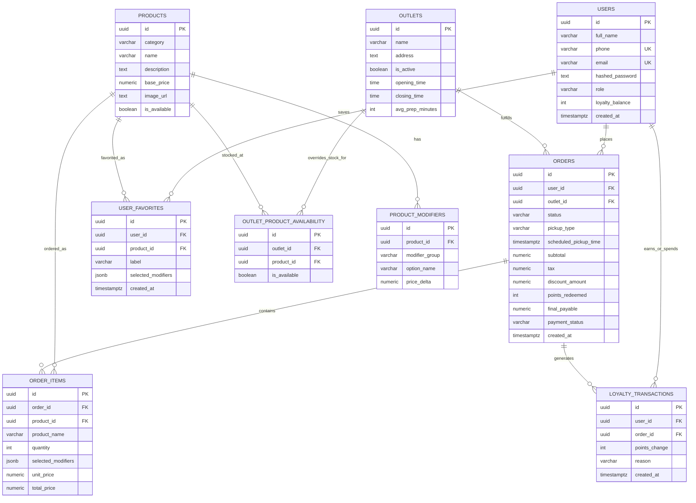

# Kaffee — Architecture & Database Overview

This document describes the system architecture, request flow, and database design of the Kaffee coffee-ordering platform, based on the backend's `API_CONTRACT.md` (the single source of truth for the FastAPI service) and the frontend's consumption of it.

---

## 1. System Architecture

### 1.1 High-Level Diagram

```
┌──────────────────────────────────────────────────────────────────────┐
│                              Clients                                  │
│   Customer Browser (Vite dev :5173 / static build via Nginx :80)     │
│   Staff / Admin Browser  →  /staff, /admin routes (same SPA)         │
└───────────────────────────────┬────────────────────────────────────┘
                                 │  HTTPS / Axios
                                 │  Authorization: Bearer <JWT>
                                 ▼
┌──────────────────────────────────────────────────────────────────────┐
│                    Frontend — React 18 + TS + Vite                    │
│  ┌───────────────┐ ┌──────────────┐ ┌───────────────┐ ┌────────────┐ │
│  │ React Query   │ │ Zustand store│ │ Axios client  │ │ AuthContext│ │
│  │ (server state,│ │ (cart, chosen│ │ (JWT interceptor,│(current   │ │
│  │  3s polling)  │ │  outlet)     │ │  401 handling)│ │ user/role) │ │
│  └───────────────┘ └──────────────┘ └───────────────┘ └────────────┘ │
└───────────────────────────────┬────────────────────────────────────┘
                                 │  REST — /api/*  (JSON over HTTP)
                                 ▼
┌──────────────────────────────────────────────────────────────────────┐
│                    Backend — FastAPI (Python 3.11+)                   │
│  ┌────────────┐ ┌───────────┐ ┌───────────┐ ┌──────────┐ ┌─────────┐ │
│  │ api/auth   │ │api/outlets│ │ api/menu  │ │api/orders│ │api/staff│ │
│  │ register,  │ │ list/get  │ │ list/get  │ │ create,  │ │ orders, │ │
│  │ login, me, │ │ outlets   │ │ products  │ │ list,get,│ │ products│ │
│  │ loyalty-   │ │           │ │+modifiers │ │ cancel,  │ │ decision│ │
│  │ history    │ │           │ │           │ │ repeat   │ │ status  │ │
│  └────────────┘ └───────────┘ └───────────┘ └──────────┘ └─────────┘ │
│  ┌────────────────────────┐  ┌───────────────────────────────────┐  │
│  │  core/security.py      │  │  core/config.py                   │  │
│  │  JWT sign/verify, bcrypt│  │  Settings via pydantic-settings   │  │
│  │  get_current_user/staff │  │  (SECRET_KEY, DB_URL, CORS, etc.) │  │
│  └────────────────────────┘  └───────────────────────────────────┘  │
│  ┌────────────────────────┐  ┌───────────────────────────────────┐  │
│  │  models/models.py       │  │  schemas/schemas.py               │  │
│  │  SQLAlchemy 2.0 ORM     │  │  Pydantic v2 request/response      │  │
│  │  (async)                │  │  validation                       │  │
│  └────────────────────────┘  └───────────────────────────────────┘  │
└───────────────────────────────┬────────────────────────────────────┘
                                 │  asyncpg (async SQLAlchemy engine,
                                 │  pool_size=10, max_overflow=20)
                                 ▼
┌──────────────────────────────────────────────────────────────────────┐
│                          PostgreSQL Database                          │
│   users · outlets · products · product_modifiers                     │
│   outlet_product_availability · orders · order_items                 │
│   loyalty_transactions · user_favorites                              │
└──────────────────────────────────────────────────────────────────────┘
```

### 1.2 Runtime & Framework Choices

| Concern | Choice |
|---|---|
| Backend language/runtime | Python 3.11+ |
| Web framework | FastAPI v0.110.0 |
| Validation layer | Pydantic v2.6.4 + pydantic-settings v2.2.1 |
| Database driver | asyncpg v0.29.0 (async PostgreSQL driver) |
| ORM | SQLAlchemy 2.0.28, async engine, connection pool (`pool_size=10`, `max_overflow=20`) |
| API docs | Swagger UI at `/docs`, ReDoc at `/redoc`, OpenAPI JSON at `/openapi.json` |
| API prefix | `/api` (all routers mounted under it, except `/health`) |
| Frontend framework | React 18 + TypeScript, built with Vite 5 |
| Server-state / polling | TanStack React Query v5 |
| Client-state | Zustand (cart contents, selected outlet) |
| HTTP client | Axios, with a JWT request interceptor and a 401 response interceptor |

### 1.3 Request Flow — Placing an Order (example)

```
Customer                Frontend (React)                Backend (FastAPI)              Database
   │  select outlet             │                               │                          │
   │────────────────────────────▶  Zustand: setOutlet()         │                          │
   │  browse menu                │──── GET /api/menu?outlet_id ─▶  join products +          │
   │                              │                                outlet_product_availability▶ SELECT
   │                              ◀── ProductOut[] (with modifiers)│                          │
   │  customize + add to cart    │  Zustand: cart += item        │                          │
   │  checkout (scheduled pickup,│                               │                          │
   │   redeem 50 pts)            │──── POST /api/orders ─────────▶  validate outlet open,    │
   │                              │      Authorization: Bearer     item availability,        │
   │                              │                                 pickup time, redemption   │
   │                              │                                 rules → compute pricing   │
   │                              │                                                            ▶ INSERT
   │                              │                                                            orders,
   │                              │                                                            order_items,
   │                              │                                                            loyalty_transactions
   │                              │                                                            UPDATE users.loyalty_balance
   │                              ◀── 201 Created  OrderOut ───────│                          │
   │  live tracking (3s polling) │──── GET /api/orders/{id} ─────▶  fetch order + items      ▶ SELECT
   │                              ◀── OrderOut (status updates) ───│                          │
```

Staff acceptance, preparation, and completion follow the same polling + REST pattern against `/api/staff/orders` and the order state-machine endpoints described in [§4](#4-order-state-machine).

### 1.4 Frontend Module Responsibilities

| Module | Responsibility |
|---|---|
| `src/api/client.ts` | Central Axios instance; attaches `Authorization: Bearer <token>` from storage, redirects to `/login` on `401`. |
| `src/context/AuthContext.tsx` | Holds the current user/role after calling `GET /api/auth/me`; exposes login/logout/register actions. |
| `src/store/useCartStore.ts` | Zustand store for cart items, selected outlet, and modifier selections; persisted across navigation. |
| `src/components/ProtectedRoute.tsx` | Route guard — blocks `/staff` and `/admin` for anyone whose role isn't `staff`/`admin`. |
| `src/components/CustomizerModal.tsx` | Drink customization UI (size/milk/sugar/add-ons) with live price delta calculation. |
| `src/pages/OutletSelectPage.tsx` | Outlet discovery and selection (calls `GET /api/outlets`). |
| `src/pages/MenuPage.tsx` | Menu browsing, filtering by category, and cart building (calls `GET /api/menu`). |
| `src/pages/CheckoutPage.tsx` | Pickup slot selection, loyalty redemption, simulated payment, order submission (calls `POST /api/orders`). |
| `src/pages/OrderTrackingPage.tsx` | Live order status polling, with the `GET /orders/{id}` → `GET /orders` fallback described in the main README. |
| `src/pages/StaffDashboardPage.tsx` | Kitchen board, accept/reject, status transitions, catalog management (calls `/api/staff/*`). |

### 1.5 Authentication & Authorization Flow

```
Frontend                                              Backend
   │── POST /api/auth/register (name, email, phone, pw) ──▶  bcrypt-hash password, INSERT users
   │◀────────────── 201 Created, UserOut (no token) ────────│
   │
   │── POST /api/auth/login (email, password) ─────────────▶  verify bcrypt hash
   │◀── 200 OK, Token{access_token, token_type, role, user_id}│  sign JWT (HS256, 7-day exp)
   │  store access_token (localStorage)
   │
   │── GET /api/auth/me   [Bearer <token>] ─────────────────▶  decode JWT `sub`, load User row
   │◀── 200 OK, UserOut (full_name, email, role, loyalty_balance)│
   │
   │── any /api/staff/* call  [Bearer <token>] ─────────────▶  get_current_staff: role in
   │                                                             {'staff','admin'} else 403
```

JWT claims: `sub` (user UUID), `role`, `email`, `name`, `iat`, `exp`. Missing/invalid/expired tokens return `401 Unauthorized` with `WWW-Authenticate: Bearer`; insufficient role returns `403 Forbidden`.

### 1.6 CORS & Deployment Topology

- Whitelisted origins (dev): `http://localhost:3000`, `http://localhost:5173`, `http://127.0.0.1:3000`, `http://127.0.0.1:5173`; credentials enabled, all methods/headers allowed.
- Local multi-container setup via `docker-compose.yml`: `backend` on `:8000`, `frontend` (built + served) on `:80`, frontend depends on backend.
- `render.yaml` provides a Render.com blueprint for managed deployment; the live demo is hosted on Vercel (frontend) at `kaffee-coffee-shop-indol.vercel.app`.

---

## 2. Database Overview

The database is **PostgreSQL**, accessed asynchronously through SQLAlchemy 2.0 + asyncpg. All primary keys are `UUID` (`uuid4`), and all timestamps are timezone-aware (`TIMESTAMPTZ`, stored in UTC).

### 2.1 Entity-Relationship Diagram



### 2.2 Table Reference

#### `users`
| Field | Type | Nullable | Notes |
|---|---|---|---|
| `id` | UUID | No | PK (`uuid4`) |
| `full_name` | VARCHAR(100) | No | |
| `phone` | VARCHAR(20) | No | Unique, indexed |
| `email` | VARCHAR(120) | No | Unique, indexed |
| `hashed_password` | TEXT | No | bcrypt hash |
| `role` | VARCHAR(20) | No | `customer` \| `staff` \| `admin` (default `customer`) |
| `loyalty_balance` | INTEGER | No | `CHECK (loyalty_balance >= 0)`, default `0` |
| `created_at` | TIMESTAMPTZ | No | UTC |

#### `outlets`
| Field | Type | Nullable | Notes |
|---|---|---|---|
| `id` | UUID | No | PK |
| `name` | VARCHAR(100) | No | e.g. "Downtown Roastery" |
| `address` | TEXT | No | |
| `is_active` | BOOLEAN | No | Operational switch, default `true` |
| `opening_time` | TIME | No | e.g. `07:00:00` |
| `closing_time` | TIME | No | e.g. `22:00:00` |
| `avg_prep_minutes` | INTEGER | No | Default `15`; drives pickup-slot generation |

#### `products`
| Field | Type | Nullable | Notes |
|---|---|---|---|
| `id` | UUID | No | PK |
| `category` | VARCHAR(50) | No | `hot_coffee` \| `cold_coffee` \| `matcha` \| `food` \| `add_ons` |
| `name` | VARCHAR(100) | No | |
| `description` | TEXT | Yes | |
| `base_price` | NUMERIC(10,2) | No | ₹ before modifiers |
| `image_url` | TEXT | Yes | |
| `is_available` | BOOLEAN | No | Global switch, default `true` |

#### `product_modifiers`
| Field | Type | Nullable | Notes |
|---|---|---|---|
| `id` | UUID | No | PK |
| `product_id` | UUID | No | FK → `products.id`, `ON DELETE CASCADE` |
| `modifier_group` | VARCHAR(50) | No | `size` \| `milk` \| `sugar` \| `add_ons` |
| `option_name` | VARCHAR(50) | No | e.g. "Oat Milk" |
| `price_delta` | NUMERIC(10,2) | No | ₹ added to base price, default `0.00` |

#### `outlet_product_availability`
| Field | Type | Nullable | Notes |
|---|---|---|---|
| `id` | UUID | No | PK |
| `outlet_id` | UUID | No | FK → `outlets.id`, `ON DELETE CASCADE`, indexed |
| `product_id` | UUID | No | FK → `products.id`, `ON DELETE CASCADE`, indexed |
| `is_available` | BOOLEAN | No | Per-outlet stock override |
| — | — | — | Unique constraint `(outlet_id, product_id)` (`uq_outlet_product`) |

#### `orders`
| Field | Type | Nullable | Notes |
|---|---|---|---|
| `id` | UUID | No | PK |
| `user_id` | UUID | No | FK → `users.id` |
| `outlet_id` | UUID | No | FK → `outlets.id` |
| `status` | VARCHAR(30) | No | State-machine status, indexed, default `ORDER_RECEIVED` |
| `pickup_type` | VARCHAR(20) | No | `immediate` \| `scheduled`, default `immediate` |
| `scheduled_pickup_time` | TIMESTAMPTZ | Yes | Required if `pickup_type = scheduled` |
| `subtotal` | NUMERIC(10,2) | No | Σ `unit_price × quantity` |
| `tax` | NUMERIC(10,2) | No | 5% GST, `round(subtotal × 0.05, 2)` |
| `discount_amount` | NUMERIC(10,2) | No | ₹1 per point redeemed |
| `points_redeemed` | INTEGER | No | Default `0` |
| `final_payable` | NUMERIC(10,2) | No | `max(0, subtotal + tax − discount_amount)` |
| `payment_status` | VARCHAR(20) | No | `PAID` (default) \| `REFUNDED` |
| `created_at` | TIMESTAMPTZ | No | UTC |

#### `order_items`
| Field | Type | Nullable | Notes |
|---|---|---|---|
| `id` | UUID | No | PK |
| `order_id` | UUID | No | FK → `orders.id`, `ON DELETE CASCADE` |
| `product_id` | UUID | No | FK → `products.id` |
| `product_name` | VARCHAR(100) | No | Snapshot at order time (survives product edits/deletes) |
| `quantity` | INTEGER | No | ≥ 1, default `1` |
| `selected_modifiers` | JSONB | No | Snapshot array: `modifier_id`, `group`, `option_name`, `price_delta` |
| `unit_price` | NUMERIC(10,2) | No | `base_price + Σ modifier.price_delta` |
| `total_price` | NUMERIC(10,2) | No | `unit_price × quantity` |

#### `loyalty_transactions`
| Field | Type | Nullable | Notes |
|---|---|---|---|
| `id` | UUID | No | PK |
| `user_id` | UUID | No | FK → `users.id` |
| `order_id` | UUID | Yes | FK → `orders.id`, `ON DELETE SET NULL` |
| `points_change` | INTEGER | No | Positive = earned, negative = redeemed |
| `reason` | VARCHAR(50) | No | `CHECKOUT_REDEEM` \| `ORDER_EARN` \| `CANCELLED_REFUND` \| `ORDER_REJECTED_REFUND` \| `REVERSAL` |
| `created_at` | TIMESTAMPTZ | No | UTC |

#### `user_favorites`
| Field | Type | Nullable | Notes |
|---|---|---|---|
| `id` | UUID | No | PK |
| `user_id` | UUID | No | FK → `users.id`, `ON DELETE CASCADE` |
| `product_id` | UUID | No | FK → `products.id`, `ON DELETE CASCADE` |
| `label` | VARCHAR(100) | Yes | e.g. "My Morning Brew" |
| `selected_modifiers` | JSONB | No | Saved modifier choices |
| `created_at` | TIMESTAMPTZ | No | UTC |

### 2.3 Relationship Summary

- **`users` 1 —— * `orders`**: a customer can place many orders; each order belongs to exactly one user.
- **`users` 1 —— * `loyalty_transactions`**: every point earn/redeem/refund event is tied to a user.
- **`users` 1 —— * `user_favorites`**: saved drink presets belong to one customer.
- **`outlets` 1 —— * `orders`**: each order is fulfilled by exactly one outlet.
- **`outlets` * —— * `products`** (via `outlet_product_availability`): a junction/override table, not a strict membership table — a missing row means the product falls back to its global `products.is_available` flag.
- **`products` 1 —— * `product_modifiers`**: each product owns its own size/milk/sugar/add-on options; deleting a product cascades to its modifiers.
- **`orders` 1 —— * `order_items`**: each order line item denormalizes (`product_name`, `unit_price`, `selected_modifiers`) at write time, so historical orders remain accurate even if the catalog changes later.
- **`orders` 1 —— * `loyalty_transactions`**: an order can generate a redemption transaction at checkout and/or an earn/refund transaction at a later status change; `order_id` is nullable so a transaction can outlive a deleted order.

### 2.4 Why Snapshot Fields Exist

`order_items.product_name`, `order_items.unit_price`, and `order_items.selected_modifiers` are **write-time snapshots**, not live joins. This is a deliberate denormalization: if a barista later renames a product, changes its price, or edits a modifier, every past receipt still reflects exactly what the customer paid and ordered at the time. The same pattern applies to `user_favorites.selected_modifiers`, which stores the customer's saved choices independently of the live `product_modifiers` table (re-validated for availability only at re-order time).

---

## 3. Business Logic & Calculation Rules

### 3.1 Pricing Pipeline

```
1. unit_price      = base_price + Σ(modifier.price_delta)
2. total_price      = unit_price × quantity                (per line item)
3. subtotal          = Σ(total_price)                        (across all items)
4. tax               = round(subtotal × 0.05, 2)              (5% GST)
5. discount_amount   = points_redeemed × 1.00                 (₹1 / point)
6. final_payable     = max(0.00, subtotal + tax − discount_amount)
```

### 3.2 Loyalty Program Rules

| Rule | Value |
|---|---|
| Earn rate | 1 point per ₹10 of `final_payable`, i.e. `floor(final_payable / 10)` |
| Points awarded | Only when an order transitions to `COMPLETED` |
| Redemption value | 1 point = ₹1.00 discount |
| Minimum redemption | 50 points (requests for 1–49 points fail with `400`) |
| Maximum redemption | Capped at the user's current `loyalty_balance`, and cannot drive `final_payable` below ₹0.00 |
| Refund triggers | Customer cancel (`CANCELLED_REFUND`), staff reject (`ORDER_REJECTED_REFUND`), staff force-cancel (`REVERSAL`) — all restore redeemed points |

### 3.3 Product Availability Resolution

When `GET /api/menu` is called with an `outlet_id`:
1. Start from `products.is_available` (global flag).
2. If a matching row exists in `outlet_product_availability` for `(outlet_id, product_id)`, its `is_available` value **overrides** the global flag for that response.
3. At order time (`POST /api/orders`), the backend re-validates every item against both the global and outlet-specific flags and rejects the whole order with `400` if any item is unavailable.

---

## 4. Order State Machine

```
                  ┌──────────────────┐
                  │  ORDER_RECEIVED  │
                  └─────────┬────────┘
                ┌───────────┼────────────────┐
                │ (Staff    │ (Staff         │ (Customer/staff
                │  Accept)  │  Reject)       │  cancel)
                ▼           ▼                ▼
        ┌───────────┐  ┌──────────┐    ┌───────────┐
        │ PREPARING │  │ REJECTED │    │ CANCELLED │
        └─────┬─────┘  └──────────┘    └───────────┘
              │ (Staff marks ready)
              ▼
    ┌────────────────────┐
    │  READY_FOR_PICKUP   │
    └─────────┬───────────┘
              │ (Staff completes / hands over)
              ▼
        ┌───────────┐
        │ COMPLETED │
        └───────────┘
```

| State | Reachable next states | Side effects |
|---|---|---|
| `ORDER_RECEIVED` | `PREPARING`, `CANCELLED`, `REJECTED` | Initial state on checkout |
| `PREPARING` | `READY_FOR_PICKUP`, `CANCELLED` | — |
| `READY_FOR_PICKUP` | `COMPLETED` | — |
| `COMPLETED` | *(terminal)* | Awards `floor(final_payable / 10)` loyalty points (`ORDER_EARN`) |
| `CANCELLED` | *(terminal)* | Sets `payment_status = REFUNDED`; reverses redeemed points |
| `REJECTED` | *(terminal)* | Sets `payment_status = REFUNDED`; reverses redeemed points (`ORDER_REJECTED_REFUND`) |

`REJECTED` is set only via `PATCH /api/staff/orders/{id}/decision`, while `CANCELLED` can be set by the customer (`PATCH /api/orders/{id}/cancel`, only while still `ORDER_RECEIVED`) or by staff via the generic FSM endpoint (`PATCH /api/staff/orders/{id}/status`). Both are treated as valid terminal states by the frontend, alongside `COMPLETED`.

---

## 5. Frontend/Backend Contract Notes Baked Into the Architecture

The frontend was built strictly against `API_CONTRACT.md` and makes **zero modifications to backend code**. A few structural points worth calling out for anyone extending the system:

- **No `user` object on login** — `POST /api/auth/login` returns only `{access_token, token_type, role, user_id}`. The frontend must call `GET /api/auth/me` immediately after to hydrate the full profile.
- **No `city` column on `outlets`** — only `name`, `address`, `is_active`, `opening_time`, `closing_time`, `avg_prep_minutes` exist; any "city" grouping in the UI is derived client-side from `address`.
- **Modifier field is `modifier_group`, not `group`** — API responses use `modifier_group`/`option_name`/`price_delta`; order/favorite payloads sent *to* the API use `group`/`option_name`/`price_delta`. The two shapes are intentionally different between read and write paths.
- **No dedicated "pickup slots" table** — slots are computed client-side from `opening_time`, `closing_time`, and `avg_prep_minutes`, then sent back as a plain `scheduled_pickup_time` datetime.
- **No real payment gateway** — orders are `PAID` immediately on creation; the "payment gateway" in the UI is a simulated modal layered on top of a synchronous, already-successful backend call.
- **`GET /api/orders/{id}` return-statement bug** — the endpoint's success path can fall through without a `return`, producing an HTTP `500`. The frontend's tracking page falls back to `GET /api/orders` and filters client-side by ID to stay resilient without ever touching backend code.
